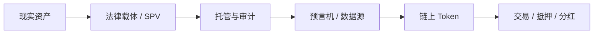

# RWA：现实世界资产上链的全景指南

RWA（Real World Assets）正在把国债、房地产、黄金、艺术品、私募信贷等现实资产带入链上世界。它的核心价值不只是“把资产做成 Token”，而是重构资产确权、流动性、收益分配与全球交易方式。

<Note>
这是一份面向产品、技术、研究与内容团队的 RWA 知识型 Blog 展示页，可直接作为 Mintlify 页面使用。
</Note>

## 为什么 RWA 值得关注

<Columns cols={3}>
  <Card title="真实收益" icon="chart-line">
    让链上资产不再只依赖激励与博弈，而是接入国债利息、租金、借款利差等现实现金流。
  </Card>

  <Card title="流动性提升" icon="arrow-right-left">
    将高门槛、低流动的资产拆分为更小单位，让更多人能够参与和交易。
  </Card>

  <Card title="全球可达" icon="globe">
    通过区块链和智能合约，资产可以面向全球钱包用户流通与结算。
  </Card>
</Columns>

## RWA 是什么

RWA 指的是把现实世界中的资产，通过法律结构、托管安排和链上合约映射为可验证、可交易、可分配收益的数字资产。

### 典型资产类型

<Tabs>
  <Tab title="国债与现金类">
    美国短期国债、货币市场基金、回购协议等通常被视为最成熟的 RWA 方向之一，核心是把低风险现金流引入链上。
  </Tab>

  <Tab title="房地产">
    商业地产、住宅物业、租金收益权等可以通过 SPV、信托或基金结构完成拆分持有。
  </Tab>

  <Tab title="艺术品">
    稀缺、可确权、可估值的艺术品适合做碎片化持有与收益权益映射，尤其适合文化与金融叙事结合的场景。
  </Tab>

  <Tab title="私募信贷">
    企业贷款、供应链融资、应收账款等资产具有较高收益，但同时也对风控、违约处理和合规要求更高。
  </Tab>

  <Tab title="商品与碳资产">
    黄金、原油、大宗商品、碳信用等资产更强调储备证明、交割逻辑和数据透明度。
  </Tab>
</Tabs>

## RWA 的基本结构

<Steps>
  <Step title="链下资产确权">
    明确资产属于谁、由谁托管、收益如何产生，以及在法律上如何定义权益。
  </Step>

  <Step title="法律载体包装">
    通过 SPV、Trust、基金、LLC 等结构承接现实资产，并与链上权益建立一一映射关系。
  </Step>

  <Step title="资产数据上链">
    资产价格、净值、收益、抵押率、清算状态等由预言机或可信数据源同步到链上。
  </Step>

  <Step title="发行链上 Token">
    以 ERC-20、ERC-721 或合规型 Token 形式承载所有权、收益权或债权权益。
  </Step>

  <Step title="分发与流通">
    用户可通过二级市场、协议内交易、收益分配合约或赎回机制参与资产流转。
  </Step>
</Steps>

## RWA 的多元化价值

<Columns cols={2}>
  <Card title="金融价值" icon="bank">
    把传统资产的现金流、利息和收益分配引入链上，形成更稳定的收益基础。
  </Card>

  <Card title="产品价值" icon="layers">
    可以构建收益型稳定币、资产抵押借贷、链上基金、碎片化投资等产品。
  </Card>

  <Card title="文化价值" icon="palette">
    艺术品、收藏品、版权等资产不仅是金融工具，也承载文化传播与审美价值。
  </Card>

  <Card title="基础设施价值" icon="cubes">
    推动链上身份、合规访问控制、托管、审计、估值和结算等基础设施升级。
  </Card>
</Columns>

## 资产赛道对比

<Tabs>
  <Tab title="国债 RWA">
    优点是风险相对低、现金流清晰、机构接受度高；适合做底层收益资产与稳定收益产品。
  </Tab>

  <Tab title="房地产 RWA">
    优点是资产体量大、可拆分性强；难点在于估值频率、法律执行与流动性管理。
  </Tab>

  <Tab title="艺术品 RWA">
    优点是稀缺性与文化溢价明显；难点在于估值主观性、交易深度与托管合规。
  </Tab>

  <Tab title="私募信贷 RWA">
    优点是收益更高，适合收益型协议；难点在于信用风险、回款周期和违约处置。
  </Tab>
</Tabs>

## 关键挑战

<AccordionGroup>
  <Accordion title="法律确权">
    链上 Token 是否真正代表现实资产权益，取决于法律文本、管辖权、托管安排和清算路径是否完备。
  </Accordion>

  <Accordion title="合规与 KYC">
    RWA 往往涉及真实金融资产，因此需要身份验证、投资者适当性管理和必要的转让限制。
  </Accordion>

  <Accordion title="数据可信度">
    资产价格、净值、收入与抵押率的来源必须可审计、可追踪，否则链上计算会失真。
  </Accordion>

  <Accordion title="流动性不足">
    即使资产被 Token 化，如果买家有限、信息不透明、退出机制不完善，流动性仍然可能不足。
  </Accordion>
</AccordionGroup>

<Warning>
RWA 的“上链”不是终点。真正决定成败的，是法律结构、托管能力、数据系统和二级市场流动性。
</Warning>

## 一条完整的 RWA 产品路径

<Columns cols={2}>
  <Card title="产品设计" icon="pen-to-square">
    明确资产类型、收益来源、持有人权益、赎回机制与投资门槛。
  </Card>

  <Card title="合规设计" icon="shield">
    明确 KYC、白名单、地区限制、披露机制和投资者风险提示。
  </Card>

  <Card title="技术实现" icon="code">
    合约负责铸造、转让限制、收益分配、赎回与权限控制；数据层负责估值和状态同步。
  </Card>

  <Card title="市场分发" icon="megaphone">
    通过官网、链上协议、合作分销和社区内容，建立认知与参与入口。
  </Card>
</Columns>

## 适合 Blog 的内容模块

<Tabs>
  <Tab title="概念科普">
    介绍 RWA 的定义、结构、案例和术语，适合新用户快速建立认知。
  </Tab>

  <Tab title="赛道分析">
    对比国债、房地产、艺术品、私募信贷等赛道的收益、风险与适配人群。
  </Tab>

  <Tab title="产品拆解">
    讲清楚一个 RWA 产品如何完成资产接入、上链、交易、收益分配和退出。
  </Tab>

  <Tab title="研究观察">
    讨论机构入场、监管趋势、链上信用体系和未来 Tokenization 方向。
  </Tab>
</Tabs>

## 可直接用于页面的 CTA

<Columns cols={3}>
  <Card title="探索更多" icon="arrow-up-right" href="https://example.com">
    查看更多 RWA 研究与产品案例
  </Card>

  <Card title="联系合作" icon="handshake" href="https://example.com">
    获取资产接入、技术实现与合规支持
  </Card>

  <Card title="阅读文档" icon="book-open" href="https://example.com">
    了解完整的 RWA 产品与架构说明
  </Card>
</Columns>

## FAQ

<AccordionGroup>
  <Accordion title="RWA 和 NFT 有什么区别？">
    NFT 更强调唯一性和凭证属性，RWA 更强调现实资产权益映射、收益分配与法律结构。
  </Accordion>

  <Accordion title="RWA 一定需要合规吗？">
    只要涉及现实资产权益、收益权或金融属性，通常都需要考虑合规、披露与用户准入问题。
  </Accordion>

  <Accordion title="RWA 适合哪些团队？">
    适合拥有资产资源、金融结构能力、链上技术能力和合规意识的团队。
  </Accordion>

  <Accordion title="RWA 最先落地的赛道是什么？">
    一般是资产结构清晰、收益稳定、监管路径相对成熟的方向，例如国债类现金管理资产。
  </Accordion>
</AccordionGroup>

<Update>
RWA 正从“概念验证”走向“基础设施建设”。未来的重点不只是资产上链，而是把现实资产组织成可编程的金融产品。
</Update>

## 结语

RWA 的长期意义，在于把现实世界中原本封闭、低流动、难参与的资产，变成可编程、可拆分、可验证、可组合的链上资产。
当资产、数据、合规与交易都被重新组织之后，Web3 才真正具备了连接现实经济的能力。
