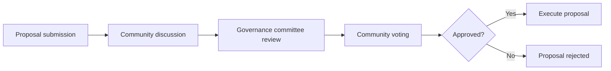

ArtStar is a blockchain platform focused on RWA (Real World Asset) tokenization for cultural relics and artworks. This tutorial helps you start from zero and progressively master the key operations for investing on ArtStar.

## Platform Overview

The ArtStar RWA project is initiated by Hangzhou Chong’er Culture Co., Ltd. (杭州崇二文化有限公司). Built with a Web3 compliance framework, it aims to provide a secure, transparent, and decentralized global value platform for tokenized cultural relics and artworks.

<Note>
  **What is RWA tokenization?** RWA tokenization is the process of converting
  physical assets (such as artworks, real estate, or gold) into tradable digital
  tokens on the blockchain. Investors can buy these tokens to indirectly own a
  portion of the underlying asset.
</Note>

### Key Highlights

| Feature                   | Description                                                   |
| ------------------------- | ------------------------------------------------------------- |
| Multi-chain compatibility | Cross-chain operations across major public chains             |
| DAO governance            | Community-driven decisions with transparency and fairness     |
| Real-world asset custody  | Verified custody by third-party authoritative institutions    |
| Compliant operations      | Aligned with Hong Kong and international regulatory standards |
| DeFi yield                | Staking, trading fees, and community rewards                  |

---

## Step 1: Preparation

### 1.1 Create a Web3 Wallet

You will need a Web3 wallet to manage your digital assets and sign on-chain transactions on ArtStar.

**Supported wallet options:**

<Tabs>
<Tab title="MetaMask">
1. Visit the [MetaMask download page](https://metamask.io/download/)
2. Click “Install MetaMask for Chrome” to install the browser extension
3. Create a new wallet or import an existing one
4. Set a strong password and back up your recovery phrase
5. Complete the security checks
</Tab>

<Tab title="WalletConnect">
  1. Download the WalletConnect app from your mobile app store 2. Open the app
  and create a new wallet 3. On ArtStar, choose “WalletConnect” as the
  connection method 4. Scan the QR code in the app to connect
</Tab>

<Tab title="Coinbase Wallet">
1. Download the Coinbase Wallet extension or app
2. Create a new wallet and back up your recovery phrase
3. On ArtStar, choose Coinbase Wallet to connect
</Tab>
</Tabs>

<Warning>
  **Security reminder:** Keep your recovery phrase and private keys safe. Never
  share them with anyone and never store them as screenshots. For large
  balances, consider using a hardware wallet.
</Warning>

### 1.2 Configure Networks

ArtStar supports multiple public chains. Configure the network that matches your needs:

```javascript
// BSC (BNB Smart Chain) Mainnet
{
  networkName: "BNB Smart Chain",
  chainId: 56,
  rpcUrl: "https://bsc-dataseed.binance.org/",
  symbol: "BNB",
  explorer: "https://bscscan.com"
}

// BSC Testnet (for testing)
{
  networkName: "BNB Smart Chain Testnet",
  chainId: 97,
  rpcUrl: "https://data-seed-prebsc-1-s1.binance.org:8545/",
  symbol: "BNB",
  explorer: "https://testnet.bscscan.com"
}
```

### 1.3 Prepare Crypto Assets

Prepare the following crypto assets before investing:

| Purpose              | Recommended tokens | Notes                    |
| -------------------- | ------------------ | ------------------------ |
| Investment principal | USDT, BTC, ETH     | Main trading pairs       |
| Gas fees             | BNB (BSC) / ETH    | Network transaction fees |
| Staking rewards      | Native token       | Participation incentives |

---

## Step 2: Access the Platform

### 2.1 Open the ArtStar App

Visit **https://app.artstarex.com** to open the platform homepage.

<Frame>
  
</Frame>

### 2.2 Connect Your Wallet

1. Click **“Connect Wallet”** in the top-right corner

2. In the wallet list, select the wallet you have installed

3. Approve the connection request (the first connection typically requires a signature)

4. After connecting, your wallet address appears in the top-right corner

```plaintext
Connection status (example):
┌─────────────────────────────────────┐
│  🔗 Wallet connected                 │
│  0x1234...abcd                       │
│  BNB: 1.5 | USDT: 1000              │
└─────────────────────────────────────┘
```

---

## Step 3: Browse Art Assets

### 3.1 Marketplace

On the homepage or the **Marketplace** page, you can browse all investable art RWA projects.

**An asset card typically includes:**

| Field                 | Description                 |
| --------------------- | --------------------------- |
| Artwork name          | e.g., “Landscape Scroll”    |
| Artist                | e.g., “Zhang Daqian”        |
| Asset valuation       | Priced in USDT              |
| Token symbol          | e.g., ART-XXX-P1            |
| Subscription progress | Remaining shares / progress |
| Estimated yield       | APR estimate                |

<Frame>
  
</Frame>

### 3.2 Asset Details Page

Click any asset card to open the details page, where you can review:

- **Artwork images**: high-resolution visuals
- **Specifications**: year, size, medium
- **Authentication reports**: documents from recognized authorities
- **Custody information**: details of the third-party custodian
- **Tokenomics**: supply, pricing mechanism, unlock schedule
- **Historical data**: price trends and trading records

<Frame>
  
</Frame>

---

## Step 4: Invest

### 4.1 Buy Tokens

<Tabs>
<Tab title="Full process">
1. On the asset details page, click **“Invest Now”**

2. Enter the number of tokens you want to buy, or the USDT amount

3. The system calculates:
   - Tokens you will receive
   - Current token price
   - Estimated gas fees

4. Review the details and click **“Confirm Purchase”**

5. Confirm the transaction in your wallet

6. Wait for on-chain confirmation (typically seconds to minutes)

7. Once successful, tokens are added to your wallet and your platform portfolio automatically
</Tab>

<Tab title="Minimum investment">
Each RWA asset has a minimum investment limit, typically:

- **Minimum per investment**: equivalent of 100 USDT
- **Maximum per transaction**: depends on your KYC tier and the asset size

<Note>
Minimum investment thresholds balance accessibility for investors and operational efficiency for asset management.
</Note>
</Tab>
</Tabs>

<Frame>
  
</Frame>

### 4.2 Trading Pairs and Pricing

ArtStar uses a **deflationary pricing model**:

```math
T = \frac{A}{N}
```

Where:

- **T** = token value
- **A** = total USD value of the underlying asset
- **N** = total token supply

<Note>
  **Deflationary mechanism:** The underlying asset is injected with a
  deflationary approach, creating potential upside for token issuance. For
  example, if an asset is valued at $100M and 100M tokens are issued, the
  initial price is 1 USDT/token.
</Note>

---

## Step 5: Staking and Yield

### 5.1 Stake Tokens

After you hold RWA tokens, you can stake them to earn additional yield:

1. Open the **Staking** page
2. Select the token you want to stake
3. Enter the staking amount (or choose “Stake all”)
4. Choose a staking term:
   - Flexible: no lockup, withdraw anytime
   - Fixed-term: 30/90/180 days, higher yield
5. Confirm staking

```plaintext
Staking yield calculation (example):
┌─────────────────────────────────────┐
│  Staked amount: 1,000 ART-XXX        │
│  APR: 8.5%                           │
│  Term: 90 days                       │
│  ─────────────────────────────────  │
│  Estimated yield:                    │
│  1000 × 8.5% × (90/365) = 20.96      │
└─────────────────────────────────────┘
```

### 5.2 Yield Sources

| Source                         | Description                                               |
| ------------------------------ | --------------------------------------------------------- |
| Staking rewards                | APR earned from staking                                   |
| Trading fee revenue share      | Fee dividends generated from token trading                |
| Ecosystem contribution rewards | Incentives for participating in community activities      |
| Asset appreciation             | Token price increases as the underlying asset value grows |

---

## Step 6: Community Governance

### 6.1 DAO Voting

As a member of the ArtStar community, you can participate in governance:

1. Open the **Governance** page
2. Review active proposals
3. Vote on proposals you care about
4. Proposal types may include:
   - Asset listing approvals
   - Staking parameter adjustments
   - Ecosystem fund usage
   - Community rule updates

<Frame>
  
</Frame>

### 6.2 Proposal Workflow



### 6.3 Points Referral Program

Invite friends to join ArtStar and earn referral rewards:

| Referrals | Reward rate                    |
| --------- | ------------------------------ |
| 1–5       | 2% of the invitee’s investment |
| 6–20      | 3% of the invitee’s investment |
| 21+       | 5% of the invitee’s investment |

<Note>
  Referral rewards are paid from the platform incentive fund and do not reduce
  the invitee’s investment returns.
</Note>

---

## Step 7: Exit and Liquidity

### 7.1 Transfer Tokens

You can transfer or sell your RWA tokens on the secondary market:

1. Open the **Marketplace** page
2. Select the **Sell** tab
3. Choose the token you want to sell
4. Set the price and amount
5. Place the order and wait for it to fill

### 7.2 Real-world Asset Exit

There are annual limits on the portion of real-world RWA assets that can exit:

| Constraint               | Description                                           |
| ------------------------ | ----------------------------------------------------- |
| Annual cap               | Not exceeding 10% of the original staked total assets |
| Cumulative cap           | Not exceeding 30% of the original staked total assets |
| Appreciation requirement | Exiting assets must have appreciated by at least 30%  |

<Warning>
  **Exit flow:** When a physical asset is acquired, the ArtStar team will buy
  back tokens from the open market and burn them, then distribute the
  appreciation proceeds to holders pro rata.
</Warning>

---

## Security and Compliance

### Security Measures

| Layer                 | Measures                                                      |
| --------------------- | ------------------------------------------------------------- |
| Asset custody         | Independent custody by third-party authoritative institutions |
| Authentication        | Evaluation by internationally recognized authenticators       |
| Smart contracts       | Professional security audits                                  |
| Multi-sig             | High-value operations require multiple signatures             |
| On-chain transparency | All transactions are traceable and verifiable                 |

### Compliance Framework

ArtStar follows key regulatory requirements, including:

- Hong Kong Virtual Asset Service Provider (VASP) regulations
- FATF Anti-Money Laundering (AML) guidance
- KYC/AML customer verification requirements
- Securities regulations related to asset tokenization

<Note>
  Before investing, make sure you understand and agree to the platform’s **User
  Agreement** and **Risk Disclosure**.
</Note>

---

## FAQ

<AccordionGroup>
<Accordion title="Q1: How do I contact support?">
You can reach the ArtStar support team via:

- **Email**: hi@artstarex.com
- **Telegram**: @artstarex
- **Twitter/X**: @artstarex
</Accordion>

<Accordion title="Q2: What if I forget my wallet password?">
If you use a self-custody wallet like MetaMask and forget your password:

1. Restore the wallet using your **recovery phrase**
2. Set a new password
3. Reconnect to the ArtStar platform

<Warning>
ArtStar does not hold your private keys and cannot reset wallet passwords for you. Keep your recovery phrase safe.
</Warning>
</Accordion>

<Accordion title="Q3: What should I do if my transaction fails?">
Common reasons and fixes:

| Reason                         | Solution                            |
| ------------------------------ | ----------------------------------- |
| Not enough gas                 | Add BNB/ETH to pay network fees     |
| Network congestion             | Wait or increase gas                |
| Per-transaction limit exceeded | Split into multiple transactions    |
| KYC not completed              | Complete verification and try again |

</Accordion>

<Accordion title="Q4: Can I unstake early?">
- **Flexible staking**: can be unstaked anytime without penalty
- **Fixed-term staking**: early unstaking may reduce rewards as a penalty

Review the staking terms carefully before staking.

</Accordion>

<Accordion title="Q5: How can I view my investment history?">
1. After connecting your wallet, click your avatar to open **Account Center**
2. Choose **My Portfolio** or **Transaction History**
3. Filter by time or token type
4. Export CSV reports if needed
</Accordion>
</AccordionGroup>

---

## Quick Start Checklist

<Steps>
1. **Create a wallet** → Install MetaMask or another Web3 wallet

2. **Get tokens** → Buy USDT/BNB via an exchange and transfer to your wallet

3. **Connect to the platform** → Visit app.artstarex.com and connect your wallet

4. **Complete KYC** → Verify your identity to unlock higher investment limits

5. **Browse assets** → Pick an artwork RWA project you’re interested in

6. **Make your first investment** → Start small to experience the full flow

7. **Stake for yield** → Stake tokens to earn passive income

8. **Join governance** → Participate in DAO decision-making
</Steps>

---

## Resources

<Card href="https://www.artstarex.com" icon="globe">
  **Official Website** Visit artstarex.com to learn more about the project
</Card>

<Card href="https://blog.artstarex.com" icon="newspaper">
  **Official Blog** Read the latest updates and market insights
</Card>

<Card href="../../documentation/introduction/en/preface" icon="book">
  **Project Introduction** Learn about ArtStar’s vision and core value
  proposition
</Card>

<Card href="../../technical/en/technical-security" icon="shield">
  **Technical & Security** Dive deeper into the platform’s architecture and
  security practices
</Card>

<Card href="../../documentation/community/en/token-economic" icon="coins">
  **Token Economics** Explore the ART ecosystem and incentive design
</Card>

---

<Note>
  This tutorial will be continuously improved as the platform evolves. If you
  have questions or suggestions, feel free to reach out via the channels above.
</Note>
