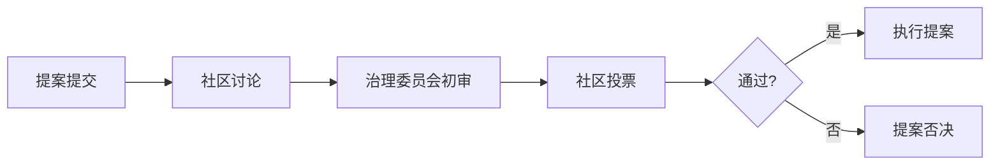

ArtStar 是一个专注于文物艺术品 RWA（Real World Assets，真实世界资产）代币化投资的区块链平台。本教程将帮助您从零开始，逐步掌握在 ArtStar 平台进行艺术品投资的所有核心操作。

## 平台简介

ArtStar RWA 项目由杭州崇二文化有限公司发起，结合 Web3 监管框架，致力于构建安全、透明、去中心化的全球文物艺术品加密数字资产价值平台。

<Note>
**什么是 RWA 代币化？** RWA 代币化是将实物资产（如艺术品、房产、黄金）通过区块链技术转换为可交易的数字代币的过程。投资者可以购买这些代币来间接持有实物资产的部分所有权。
</Note>

### 核心特色

| 特色 | 说明 |
|------|------|
| 多链兼容 | 支持主流公链的跨链操作 |
| DAO 治理 | 社区参与决策，透明公平 |
| 实物资产托管 | 第三方权威机构托管验证 |
| 合规运营 | 符合香港及国际监管标准 |
| DeFi 收益 | 质押、交易费、社区奖励 |

---

## 第一步：准备工作

### 1.1 创建 Web3 钱包

ArtStar 平台需要使用 Web3 钱包来管理您的数字资产和进行链上交易。

**支持的钱包类型：**

<Tabs>
<Tab title="MetaMask">
1. 访问 [MetaMask 官网](https://metamask.io/download/)
2. 点击"Install MetaMask for Chrome"安装浏览器扩展
3. 创建新钱包或导入已有钱包
4. 设置强密码并保存助记词
5. 完成安全验证
</Tab>

<Tab title="WalletConnect">
1. 在手机应用商店下载 WalletConnect App
2. 打开 App 并创建新钱包
3. 在 ArtStar 平台选择"WalletConnect"连接方式
4. 使用 App 扫描二维码完成连接
</Tab>

<Tab title="Coinbase Wallet">
1. 下载 Coinbase Wallet 扩展或 App
2. 创建新钱包并备份助记词
3. 在 ArtStar 选择 Coinbase Wallet 连接
</Tab>
</Tabs>

<Warning>
**重要安全提示：** 务必妥善保管您的助记词和私钥！切勿向任何人透露，也不要截图保存。建议使用硬件钱包存储大额资产。
</Warning>

### 1.2 配置网络

ArtStar 平台支持多条公链，请根据您的需求配置网络：

```javascript
// BSC (BNB Smart Chain) 主网配置
{
  networkName: "BNB Smart Chain",
  chainId: 56,
  rpcUrl: "https://bsc-dataseed.binance.org/",
  symbol: "BNB",
  explorer: "https://bscscan.com"
}

// BSC Testnet 配置（用于测试）
{
  networkName: "BNB Smart Chain Testnet",
  chainId: 97,
  rpcUrl: "https://data-seed-prebsc-1-s1.binance.org:8545/",
  symbol: "BNB",
  explorer: "https://testnet.bscscan.com"
}
```

### 1.3 准备加密货币

您需要持有以下加密货币用于投资：

| 用途 | 推荐代币 | 说明 |
|------|----------|------|
| 投资本金 | USDT、BTC、ETH | 主要交易对 |
| Gas 费用 | BNB (BSC) / ETH | 网络手续费 |
| 质押奖励 | 原生 Token | 参与生态激励 |

---

## 第二步：访问平台

### 2.1 打开 ArtStar 应用

访问 **https://app.artstarex.com** 进入平台首页。

<Frame>

</Frame>

### 2.2 连接钱包

1. 点击页面右上角的"**连接钱包**"按钮

2. 在弹出的钱包选择列表中，选择您已安装的钱包类型

3. 确认连接请求（首次连接需要签名授权）

4. 连接成功后，页面右上角将显示您的钱包地址

```plaintext
连接状态示意：
┌─────────────────────────────────────┐
│  🔗 已连接钱包                       │
│  0x1234...abcd                       │
│  BNB: 1.5 | USDT: 1000              │
└─────────────────────────────────────┘
```

---

## 第三步：浏览艺术品资产

### 3.1 资产市场

在平台首页或"**市场**"页面，您可以浏览所有可投资的艺术品 RWA 项目。

**每个艺术品资产卡片通常包含：**

| 信息项 | 说明 |
|--------|------|
| 艺术品名称 | 如《山水长卷》 |
| 艺术家 | 如"张大千" |
| 资产估值 | USDT 计价 |
| 代币符号 | 如 ART-XXX-P1 |
| 已认购比例 | 显示剩余份额 |
| 预期年化收益 | APR 估算 |

<Frame>

</Frame>

### 3.2 资产详情页

点击感兴趣的资产卡片进入详情页，可查看：

- **艺术品图片**：高清大图展示
- **详细信息**：创作年代、尺寸、材质
- **鉴定报告**：权威机构出具的鉴定文件
- **托管信息**：第三方托管机构详情
- **代币经济学**：发行量、价格机制、解锁计划
- **历史数据**：价格走势、交易记录

<Frame>

</Frame>

---

## 第四步：进行投资

### 4.1 购买代币

<Tabs>
<Tab title="完整流程">
1. 在资产详情页，点击"**立即投资**"按钮

2. 输入您想购买的代币数量或 USDT 金额

3. 系统自动计算：
   - 获取的代币数量
   - 当前代币价格
   - 预估 Gas 费用

4. 确认交易详情无误后，点击"**确认购买**"

5. 在钱包中确认签名交易

6. 等待链上确认（通常几秒到几分钟）

7. 交易成功后，代币自动添加到您的钱包和平台持仓
</Tab>

<Tab title="最低投资额">
每个 RWA 资产都有最低投资限额，通常为：

- **最低单次投资**：100 USDT 等值
- **单笔最高投资**：根据 KYC 级别和资产规模而定

<Note>
最低投资额的设置旨在平衡投资者参与门槛与资产管理的效率需求。
</Note>
</Tab>
</Tabs>

<Frame>

</Frame>

### 4.2 交易对与价格

ArtStar 平台采用**通缩定价模型**：

```math
T = \frac{A}{N}
```

其中：
- **T** = 每个代币的价值
- **A** = 实物资产的美元总价值
- **N** = 发行的代币总数

<Note>
**通缩机制**：实物资产采用通缩方式注入，为代币发行创造潜在增值空间。例如：资产估值 1 亿美元，发行 1 亿枚代币，则初始价格 = 1 USDT/token。
</Note>

---

## 第五步：质押与收益

### 5.1 质押代币

持有 RWA 代币后，您可以参与质押获取额外收益：

1. 进入"**质押**"页面
2. 选择要质押的代币类型
3. 输入质押数量（或选择"全部质押"）
4. 选择质押期限：
   - 灵活期限：无锁定期限，随时提取
   - 定期质押：30/90/180 天，收益更高
5. 确认质押

```plaintext
质押收益计算：
┌─────────────────────────────────────┐
│  质押数量：1,000 ART-XXX           │
│  年化收益率 (APR)：8.5%             │
│  质押期限：90 天                    │
│  ─────────────────────────────────  │
│  预计收益：                        │
│  1000 × 8.5% × (90/365) = 20.96  │
└─────────────────────────────────────┘
```

### 5.2 收益类型

| 收益来源 | 说明 |
|----------|------|
| 质押奖励 | 持有质押获取的年化收益 |
| 交易手续费分成 | 代币交易产生的费用分红 |
| 生态贡献奖励 | 参与社区活动获得的激励 |
| 资产增值 | 代币价格随资产价值上涨 |

---

## 第六步：社区治理

### 6.1 DAO 投票

作为 ArtStar 社区成员，您可以参与平台治理：

1. 进入"**治理**"页面
2. 查看当前提案列表
3. 选择您关注的提案进行投票
4. 提案类型包括：
   - 资产上线审批
   - 质押参数调整
   - 生态基金使用
   - 社区规则修订

<Frame>

</Frame>

### 6.2 提案流程



### 6.3 积分推荐计划

邀请好友加入 ArtStar 可获得推荐奖励：

| 推荐人数 | 推荐奖励比例 |
|----------|-------------|
| 1-5 人 | 获得被推荐人投资的 2% |
| 6-20 人 | 获得被推荐人投资的 3% |
| 21 人及以上 | 获得被推荐人投资的 5% |

<Note>
推荐奖励从平台激励基金中拨付，不影响被推荐人的投资收益。
</Note>

---

## 第七步：资产退出

### 7.1 代币转让

您可以在二级市场转让持有的 RWA 代币：

1. 进入"**市场**"页面
2. 选择"**卖出**"标签
3. 选择要卖出的代币类型
4. 设置出售价格和数量
5. 挂单等待买家成交

### 7.2 实物资产退出

每个年度允许退出的 RWA 实物资产有比例限制：

| 限制条件 | 说明 |
|----------|------|
| 年度上限 | 不超过原始质押总资产的 10% |
| 累计上限 | 不超过原始质押总资产的 30% |
| 增值要求 | 退出资产需增值 30% 以上 |

<Warning>
**退出流程**：当实物资产被收购后，ArtStar 团队将从公开市场回购代币并销毁，同时将增值收益按比例分配给持有人。
</Warning>

---

## 安全与合规

### 安全措施

| 安全层级 | 具体措施 |
|----------|----------|
| 资产托管 | 第三方权威机构独立托管 |
| 鉴定验证 | 国际知名鉴定机构评估 |
| 智能合约 | 专业安全审计 |
| 多签机制 | 高价值交易需多方签名 |
| 链上透明 | 所有交易可追溯验证 |

### 合规框架

ArtStar 严格遵守以下监管要求：

- 香港虚拟资产服务提供商（VASP）相关法规
- FATF 反洗钱（AML）指引
- KYC/AML 客户身份验证
- 资产代币化相关证券法规

<Note>
在投资前，请确保您了解并同意平台的**用户协议**和**风险提示**。
</Note>

---

## 常见问题

<AccordionGroup>
<Accordion title="Q1: 如何联系客服？">
您可以通过以下方式联系 ArtStar 客服团队：

- **邮箱**：hi@artstarex.com
- **Telegram**：@artstarex
- **Twitter/X**：@artstarex
</Accordion>

<Accordion title="Q2: 忘记钱包密码怎么办？">
如果您使用的是 MetaMask 等自托管钱包，忘记密码后：

1. 使用**助记词**恢复钱包
2. 创建新密码
3. 重新连接 ArtStar 平台

<Warning>
ArtStar 平台不持有您的私钥，无法帮您重置钱包密码。请务必安全保管助记词！
</Warning>
</Accordion>

<Accordion title="Q3: 交易失败怎么办？">
常见交易失败原因及解决方案：

| 原因 | 解决方案 |
|------|----------|
| Gas 费不足 | 充值 BNB/ETH 支付手续费 |
| 网络拥堵 | 等待或提高 Gas 费用 |
| 超出单笔限额 | 分拆为多笔交易 |
| KYC 未完成 | 完成身份验证后重试 |
</Accordion>

<Accordion title="Q4: 质押可以提前解除吗？">
- **灵活期限质押**：可随时解除，无惩罚
- **定期质押**：提前解除将扣除部分奖励作为违约金

建议在质押前仔细阅读质押协议条款。
</Accordion>

<Accordion title="Q5: 如何查看我的投资记录？">
1. 连接钱包后，点击头像进入"**个人中心**"
2. 选择"**我的持仓**"或"**交易记录**"标签
3. 可按时间、代币类型筛选查询
4. 支持导出 CSV 格式报表
</Accordion>
</AccordionGroup>

---

## 快速入门清单

<Steps>
1. **创建钱包** → 安装 MetaMask 或其他 Web3 钱包

2. **获取代币** → 通过交易所购买 USDT/BNB 并充值到钱包

3. **连接平台** → 访问 app.artstarex.com 并连接钱包

4. **KYC 验证** → 完成身份验证以获得更高投资限额

5. **浏览资产** → 选择感兴趣的艺术品 RWA 项目

6. **完成首投** → 小额试投体验完整流程

7. **质押收益** → 将代币质押获取被动收入

8. **参与治理** → 加入 DAO 社区参与决策
</Steps>

---

## 相关资源

<Card href="https://www.artstarex.com" icon="globe">
**官方网站**
访问 artstarex.com 了解更多项目信息
</Card>

<Card href="https://blog.artstarex.com" icon="newspaper">
**官方博客**
阅读最新项目进展和市场分析
</Card>

<Card href="../../documentation/introduction/zh/前言" icon="book">
**项目介绍**
了解 ArtStar 的愿景与核心价值
</Card>

<Card href="../../technical/zh/技术及安全" icon="shield">
**技术安全**
深入了解平台的技术架构
</Card>

<Card href="../../documentation/community/zh/社区经济" icon="coins">
**社区经济**
探索 ART 代币的经济模型
</Card>

---

<Note>
本教程会随平台功能更新而持续完善。如有疑问或建议，欢迎通过上述联系方式与我们交流。
</Note>
