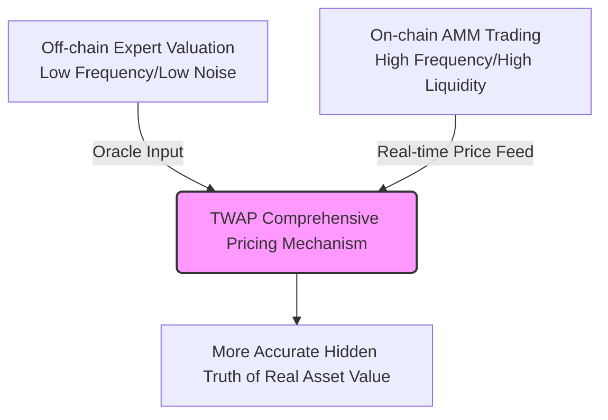

## <Icon icon="book-open" /> Overview

Fine art is traditionally considered a highly illiquid asset.
RWA tokenization does not overturn the basic laws of asset pricing, but rather re-parameterizes "friction terms" such as illiquidity, indivisibility, and information asymmetry into external variables approaching zero.

---

## <Icon icon="water" /> Liquidity Release

### The Traditional Dilemma

Longstaff's (1995) classic model demonstrates that "non-tradability" causes a significant discount on asset value.
This discount is essentially the value of a **Lookback Option**—when unable to sell, investors are forced to bear the risk of the price falling back from its peak.
The longer the lock-up period $T$, the greater the discount.

$$
\text{Discount} = \frac{1}{T} \int_0^T \exp(-r\tau) \, \mathbb{E}\left[ \max\left(0, \max_{0 \le s \le \tau} (m_s - m_0)\right) \right] d\tau
$$

- $T$: The "lock-up period" during which the asset must be held and cannot be traded
- $m_s$: The log-price process of the underlying asset (Geometric Brownian Motion)
- $r$: The risk-free interest rate

### The RWA Advantage

After tokenization, fragments can be traded on DEXs at any time, compressing $T$ from several years to almost zero.
Even if the asset's fundamentals remain unchanged, merely eliminating the non-tradable period can cause the theoretical value to jump significantly.

<Note>
When $T \to 0$, the asset not only eliminates the liquidity discount but also generates a **Liquidity Premium**.

Tokenized art has real-time fair value (Mark-to-Market) and can be integrated into lending protocols like Aave and MakerDAO as collateral.

Art transforms from a "static asset" into an "interest-bearing asset" or "credit foundation."
</Note>

---

## <Icon icon="puzzle-piece" /> Fragmentation and Portfolio Optimization

### The Traditional Dilemma

In the Markowitz mean-variance framework, art can improve the efficient frontier.
But the realistic constraint is: a single piece of art starts at a million dollars and is indivisible, constituting an investment floor $M_{\min}$.

The optimization problem before fragmentation:

$$
\begin{align}
\min_{w} \quad & \frac{1}{2} w^\top \Sigma w \\
\text{s.t.} \quad & w^\top \mu = r_{\text{target}} \\
& \sum w_i = 1 \\
& w_{\text{art}} \cdot W_0 \ge M_{\min} \text{ or } w_{\text{art}} = 0
\end{align}
$$

$W_0$ is the initial wealth, forcing a large number of small investors to have $w_{\text{art}} = 0$.

### The RWA Advantage

Tokenization reduces the minimum investment unit from $M_{\min}$ to $M_{\text{token}}$ (at the level of a few dollars).
The constraint $w_{\text{art}} \cdot W_0 \ge M_{\text{token}}$ almost always holds true.

**Result**: The feasible region expands, the efficient frontier shifts significantly up or to the left, and the overall Sharpe ratio improves.

<Note>
Traditional art can almost never undergo **Dynamic Rebalancing**.

After tokenization, transaction fees are extremely low, allowing the use of automated vaults or grid strategies for high-frequency mean-variance optimization.

It even allows small capitals to engage in **Dollar Cost Averaging (DCA)**.
</Note>

---

## <Icon icon="magnifying-glass-chart" /> Price Discovery Efficiency

### The Traditional Dilemma

Kyle's (1985) market microstructure model characterizes the information efficiency of prices:

$$
\Delta p_t = \lambda \cdot (y_t + u_t), \quad \lambda = \frac{2\sigma_v}{\sigma_u}
$$

- $\lambda$: Kyle's lambda, the price impact of unit net order flow (the inverse of market depth)
- $\sigma_v$: Uncertainty of asset value (degree of information asymmetry)
- $\sigma_u$: Number of noise trades

The speed at which information is incorporated into prices is positively correlated with the total number and diversity of market participants.

### The RWA Advantage

Traditional auctions are held a few times a year, with participants limited to a small circle, resulting in huge $\sigma_v$ and high $\lambda$.
After tokenization, art enters a globalized on-chain market:

- The base of traders $n$ increases dramatically, amplifying $\sigma_u$ (liquidity improvement).
- Informed traders expand from a few experts to global curators and data scientists, gradually reducing $\sigma_v$.

$\lambda$ tends to decline, and prices converge more accurately to the "hidden truth" of the asset.

<Note>
High-frequency on-chain prices need to be combined with professional off-chain appraisals.

A **Time-Weighted Average Price (TWAP)** is constructed through a decentralized oracle.

The game between authoritative off-chain valuations (slow variable) and on-chain AMM spot prices (fast variable) minimizes $\sigma_v$.
</Note>

---

## <Icon icon="infinity" /> Continuous Liquidity

### The Traditional Dilemma

Market making for traditional art relies on the capital of brokers, resulting in extremely high spreads.

### The RWA Advantage

The AMM constant product function directly provides liquidity without the need for matching buy and sell orders:

$$
x \cdot y = k
$$

$x$ = Number of art tokens in the pool, $y$ = Number of stablecoins.
The purchase slippage is approximately:

$$
\text{Price impact} \approx \frac{\Delta x}{x}
$$

The larger the $k$, the smaller the price impact for the same trading volume.
Fragmentation allows small token holders to provide liquidity, pushing $k$ exponentially beyond the capital of traditional market makers.
The effective spread of tokenized art is far lower than the traditional auction commission (20%–30%), achieving mathematically **decentralized liquidity**.

<Note>
Under the Uniswap V3 model, LPs can concentrate funds in a specific price range $[P_a, P_b]$.

For art with stable short-term prices, the local $k$ value can be amplified by dozens of times.

Even mid-to-small cap art RWAs can offer a low-slippage experience comparable to blue-chip stocks in core price ranges.
</Note>

---

## <Icon icon="network-wired" /> Network Value Growth

### Theoretical Model

The value of fungible tokens has a super-linear relationship with the size of the community network (a modified form of Metcalfe's Law):

$$
V \propto n \log n \quad \text{or} \quad V \propto n^2
$$

$n$ = Number of token holders or active users.

### The RWA Advantage

When tokenized art is communally owned, each holder naturally becomes a propagator and curatorial driver.
The addition of every new collector not only brings buying power but also contributes +1 network effect to the art's cultural prestige.
The low barrier to entry allows $n$ to grow exponentially, activating super-linear value feedback—a mathematical structure that a single physical collection cannot achieve.

<Note>
Holders can exercise voting rights through a DAO—deciding on art lending, secondary creation authorization, etc.

Governance rights themselves have pricing room.

The larger the $n$, the higher the cultural meme and commercial authorization income, leading to a qualitative leap in the DCF model.
</Note>