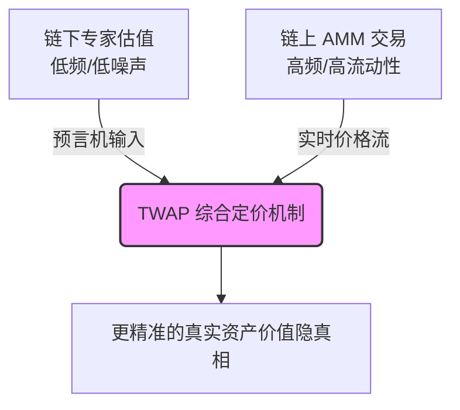

## <Icon icon="book-open" /> 概述

艺术品传统上属于高度非流动资产
RWA 代币化并未推翻资产定价的基本规律，而是将非流动性、不可分性、信息不对称性这些"摩擦项"重新参数化为趋近于零的外部变量

---

## <Icon icon="water" /> 流动性释放

### 传统困境

Longstaff（1995）经典模型表明，"不可交易性"对资产价值造成显著折价
该折扣本质上是 **回望期权（Lookback Option）** 的价值——无法卖出时，投资者被迫承受价格从峰值回落的风险
锁定期 $T$ 越长，折扣越大

$$
\text{Discount} = \frac{1}{T} \int_0^T \exp(-r\tau) \, \mathbb{E}\left[ \max\left(0, \max_{0 \le s \le \tau} (m_s - m_0)\right) \right] d\tau
$$

- $T$：必须持有而无法交易的"锁定期"
- $m_s$：标的资产的对数价格过程（几何布朗运动）
- $r$：无风险利率

### RWA 优势

代币化后，碎片可在 DEX 随时交易，$T$ 从数年压缩至几乎为零
即使资产基本面不变，仅消除不可交易期，理论价值就能显著跳升

<Note>
当 $T \to 0$ 时，资产不仅消除流动性折价，还会产生**流动性溢价（Liquidity Premium）**

代币化艺术品具备实时公允价值（Mark-to-Market），可整合进 Aave、MakerDAO 等借贷协议作为抵押品

艺术品从"静止资产"转变为"生息资产"或"信用基础"
</Note>

---

## <Icon icon="puzzle-piece" /> 碎片化与组合优化

### 传统困境

马科维茨均值-方差框架中，艺术品可改善有效前沿
但现实约束是：单件艺术品百万美元起步且不可拆分，构成投资下限 $M_{\min}$

碎片化前的优化问题：

$$
\begin{align}
\min_{w} \quad & \frac{1}{2} w^\top \Sigma w \\
\text{s.t.} \quad & w^\top \mu = r_{\text{target}} \\
& \sum w_i = 1 \\
& w_{\text{art}} \cdot W_0 \ge M_{\min} \text{ 或 } w_{\text{art}} = 0
\end{align}
$$

$W_0$ 为初始财富，大量小额投资者被迫 $w_{\text{art}} = 0$

### RWA 优势

代币化将最小投资单位从 $M_{\min}$ 降至 $M_{\text{token}}$（几美元级别）
约束 $w_{\text{art}} \cdot W_0 \ge M_{\text{token}}$ 几乎恒成立

**结果**：可行域扩张，有效前沿显著左移或上移，整体夏普比率提升

<Note>
传统艺术品几乎无法**动态再平衡（Dynamic Rebalancing）**

代币化后，交易手续费极低，可使用自动化金库或网格策略进行高频均值-方差优化

甚至允许小资金**定投（DCA）**
</Note>

---

## <Icon icon="magnifying-glass-chart" /> 价格发现效率

### 传统困境

Kyle（1985）市场微观结构模型刻画了价格的信息有效性：

$$
\Delta p_t = \lambda \cdot (y_t + u_t), \quad \lambda = \frac{2\sigma_v}{\sigma_u}
$$

- $\lambda$：Kyle's lambda，单位净订单流的价格冲击（市场深度倒数）
- $\sigma_v$：资产价值不确定性（信息不对称程度）
- $\sigma_u$：噪声交易数量

信息融入价格的速度与市场参与者的总量和多样性正相关

### RWA 优势

传统拍卖一年数次，参与者限于小圈子，$\sigma_v$ 极大、$\lambda$ 极高
代币化后，艺术品进入全球化链上市场：

- 交易者基数 $n$ 急剧增大，$\sigma_u$ 放大（流动性提升）
- 知情交易者从少数专家扩展至全球策展人与数据科学家，$\sigma_v$ 逐步衰减

$\lambda$ 趋于下降，价格更精准地收敛于资产的"隐真相"

<Note>
链上高频价格需与链下专业鉴定结合

通过去中心化预言机构建**时间加权平均价格（TWAP）**

链下权威估值（慢变量）与链上 AMM 现货价格（快变量）博弈，$\sigma_v$ 降至最低
</Note>

---

## <Icon icon="infinity" /> 四、持续流动性

### 传统困境

传统艺术品做市依赖经纪商资本金，点差极高

### RWA 优势

AMM 恒定乘积函数直接提供流动性，无需买卖盘匹配：

$$
x \cdot y = k
$$

$x$ = 池中艺术品代币数量，$y$ = 稳定币数量
买入滑点（Slippage）约为：

$$
\text{Price impact} \approx \frac{\Delta x}{x}
$$

$k$ 越大，相同交易量的价格冲击越小
碎片化使小额持币者均可提供流动性，$k$ 指数级超越传统做市商资本
代币化艺术品的有效价差远低于传统拍卖佣金（20%–30%），实现数学上的**去中心化流动性**

<Note>
Uniswap V3 模式下，LP 可将资金集中在特定价格区间 $[P_a, P_b]$

对于短期价格稳定的艺术品，局部 $k$ 值可放大数十倍

中小市值艺术品 RWA 也能在核心价格区间提供媲美蓝筹股的低滑点体验
</Note>

---

## <Icon icon="network-wired" /> 网络价值增长

### 理论模型

同质化代币的价值与社区网络规模呈超线性关系（Metcalfe 定律修正形式）：

$$
V \propto n \log n \quad \text{或} \quad V \propto n^2
$$

$n$ = 代币持有者或活跃用户数

### RWA 优势

艺术品代币化为社区共有时，每位持有者自然成为传播者与策展推动者
每一位新藏家的加入，不仅带来买盘，更为艺术品文化声望贡献 +1 网络效应
低参与门槛令 $n$ 实现指数增长，激活超线性价值反馈——这是单一实物收藏无法实现的数学结构

<Note>
持有者可通过 DAO 行使投票权——决定艺术品出借、二次创作授权等

治理权本身具备定价空间

$n$ 越大，文化模因与商业授权收入越高，DCF 模型发生质的飞跃
</Note>

